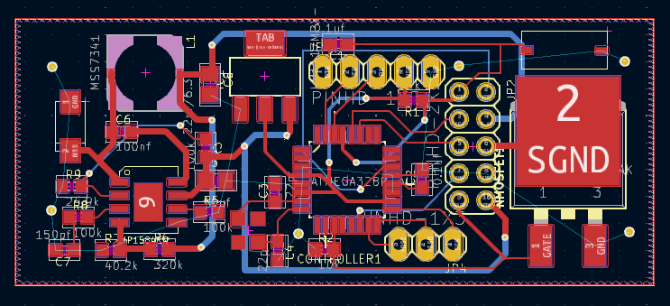
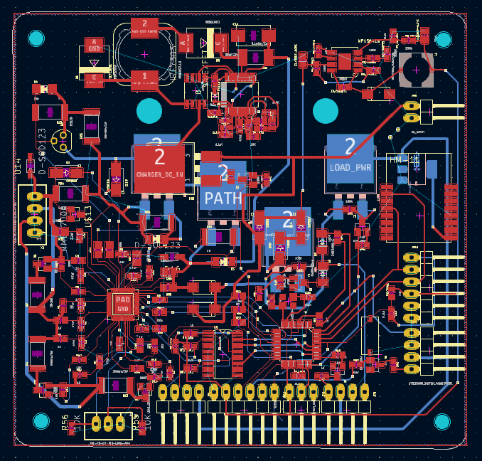

# Hardware designs for Ani-B project
=====================================

**Table of Contents**
=======================

1. [Introduction](#introduction)
2. [Features](#features)
3. [Hardware Requirements](#hardware-requirements)
4. [Software Requirements](#software-requirements)
5. [Getting Started](#getting-started)
6. [Contributing](#contributing)

**Introduction**
---------------

Welcome to the **A.n.i B** Hardware Design repository. The repository is to maintain designs for boards to meet the control and power management needs of a light weight computer with spacial motion.

This repository contains the design files for two boards: the servo driver board (Ani-B-Servo) and the power management board (Ani-B-Power). The servo driver board can drive a single servo, while the power management board takes data from an SBC (Single-Board Computer) via UART, processes it, and sends relevant information to multiple Ani-B-Servo boards via I2C. Additionally, the power management board manages a 3-cell BMS (Battery Management System), controls charging of the battery, and implements button control for power and attention management.

**Features**
-------------

* Ani-B-Servo control board:
	+ Drives a single servo with PWM output
	+ Accept and perform the servo motion on a requested easing path
	+ Power and signal control of a servo
	+ Compact design for easy installation in small spaces
	+ Uses Atmega328 microcontroller
    + 

* Ani-B-Power control board:
	+ Receives data from SBC via UART 
	+ Parse and filters data as needed
	+ Sends relevant information to multiple Ani-B-Servo boards via I2C 
	+ Manages 3-cell BMS for safe shutdown
	+ Controls charging of the battery
	+ Raises power control and logic control button events
    + 

**Hardware Requirements**
-------------------------

* A PC with KiCad installed
* Atmega328 microcontrollers for Ani-B-Servo boards
* Various electronic components

**Software Requirements**
-------------------------

* KiCad 6.0 or later

**Getting Started**
-------------------

1. Clone this repository to your local machine using `git clone 
https://github.com/your-username/anib-project.git`
2. Open KiCad and create a new project from the cloned repository
3. Start designing the boards by adding components, wires, and other features as needed

**How to Contribute**
--------------------

If you would like to contribute to this repository, please follow these steps:

1. **Fork the repository**: Click the "Fork" button on GitHub to create a copy of this 
repository.
2. **Design and prototype**: Design and prototype your component using CAD software and 
manufacturing techniques.
3. **Submit a pull request**: Submit a pull request with your new design and any modifications 
you made to existing components.

**License**
-----------

This repository is licensed under the [GNU GENERAL PUBLIC LICENSE](https://github.com/itej89/ani_b_mech_designs/blob/main/LICENSE). See 
`LICENSE.md` for details.

**Acknowledgments**
------------------

* This repository is created and maintained by the original designer of A.n.i B